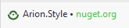

# Arion style

## Библиотека компонентов и стилей

___

## Подключение

В менеджере пакетов Nuget находите пакет ```Arion.Style``` и устанавливаете его



В документ ```App.xaml``` добавляете словарь

```xaml
<ResourceDictionary>
    <ResourceDictionary.MergedDictionaries>
        <ResourceDictionary Source="/Arion.Theme;component/ArionUiTheme.xaml" />
    </ResourceDictionary.MergedDictionaries>
</ResourceDictionary>
```
Использование конкретных элементов прописано в самом элементе
___

### Оглавление

1. [Кнопки](#Кнопка)
2. [Текстовые поля](#Текстовое-поле)
3. [Чек бокс](#Чек-бокс)
4. [Переключатель](#Переключатель)
5. [Радио кнопки](#Радио-кнопки)
6. [Свитчер](#Свитчер)
7. [Слайдер](#Слайдер)
8. [Списки](#Списки)
9. [Табы](#Табы)
10. [Всплывающие подсказки](#Всплывающие-подсказки)
11. [Цвета](#Цвета)
12. [Иконки](#Иконки)

### Кнопка


### Текстовое поле

### Чек бокс

### Переключатель

### Радио кнопки

### Свитчер

### Слайдер

### Табы

### Всплывающие подсказки

### Цвета

### Иконки