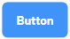
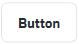
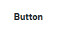
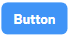
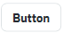
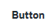
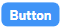
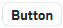
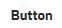

# Arion style

## Библиотека компонентов и стилей

___

## Подключение

В менеджере пакетов Nuget находите пакет `Arion.Style` и устанавливаете его


В документ ```App.xaml``` добавляете словарь

```xaml
<ResourceDictionary>
    <ResourceDictionary.MergedDictionaries>
        <ResourceDictionary Source="/Arion.Theme;component/ArionUiTheme.xaml" />
    </ResourceDictionary.MergedDictionaries>
</ResourceDictionary>
```
Использование конкретных элементов прописано в самом элементе
___

### Оглавление

1. [Кнопки](#Кнопка)
2. [Текстовые поля](#Текстовое-поле)
3. [Чек бокс](#Чек-бокс)
4. [Переключатель](#Переключатель)
5. [Радио кнопки](#Радио-кнопки)
6. [Свитчер](#Свитчер)
7. [Слайдер](#Слайдер)
8. [Списки](#Списки)
9. [Табы](#Табы)
10. [Всплывающие подсказки](#Всплывающие-подсказки)
11. [Цвета](#Цвета)
12. [Иконки](#Иконки)

___

### Кнопка

#### Обычные кнопки

Есть несколько типов стилей кнопок `Filled`, `Outline`, `Text`

Filled - Закрашенные без рамок
Outline - Белые кнопки с рамками
Text - Белые кнопки без рамок, на белом фоне похожи на простой текст, пока не наведешь

Так же есть 3 размера этих кнопок Large(`Lg`), Medium(`Md`) и Small(`Sm`)

Для использования стилей пишете сначала тип кнопки, потом её размер в сокращенном варианте

Доступные стили для версии 0.1.3

|             | Filled                                            | Outline                                             | Text                                          |
|-------------|---------------------------------------------------|-----------------------------------------------------|-----------------------------------------------|
| Large (Lg)  |  |  |  |
| Medium (Md) |  |  |  |
| Small (Sm)  |  |  |  |

`FilledLg`,
`FilledMd`, 
`FilledSm`,
`OutlineLg`,
`OutlineMd`,
`OutlineSm`,
`TextLg`,
`TextMd`,
`TextSm`.

___

### Текстовое поле

### Чек бокс

### Переключатель

### Радио кнопки

### Свитчер

### Слайдер

### Табы

### Всплывающие подсказки

### Цвета

### Иконки